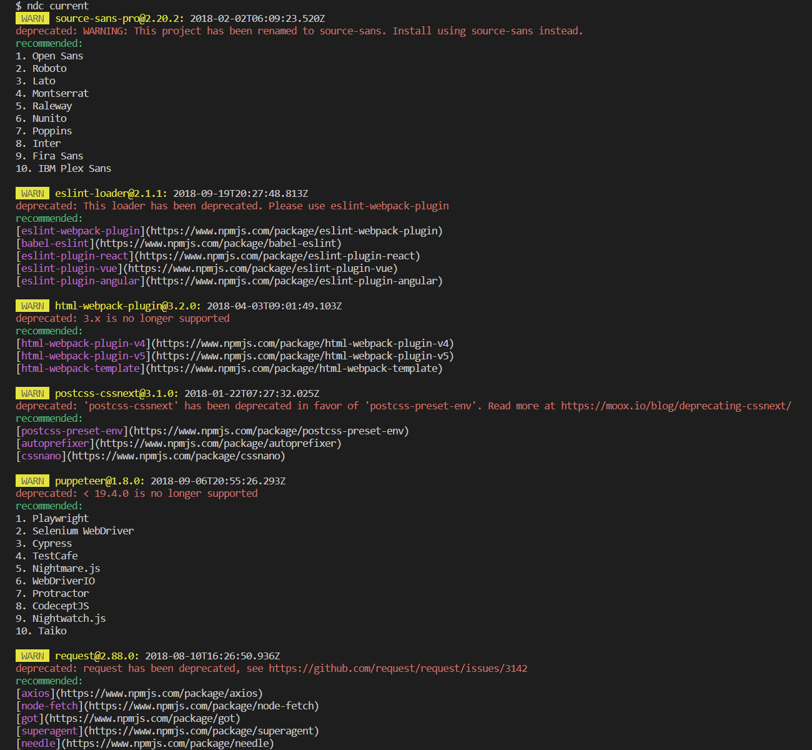

<h1 align="center">🐦 npm-deprecated-check</h1>
<p align="center">Check for deprecated packages</p>

## Preview

<p align="center"></p>

## Requirements

Since version 1.4.0, `npm-deprecated-check` requires Node.js 18 or higher.

## Install

```bash
npm install -g npm-deprecated-check
```

## Features

- Check the packages of current project, global or specified is deprecated.
- According to the version range of lockfile and package.json.
- Recommend alternative packages through OpenAI.
- Additionally checks if the running node version reached End Of Life.

## Usage

```bash
Usage: ndc <command> [options]

Options:
  -V, --version                    output the version number
  -h, --help                       display help for command

Commands:
  current [options]                check the packages of the current project
  global [options]                 check global packages, default: npm
  package [options] <packageName>  check for specified package
  node                             check if used node version is deprecated (reached End Of Life)
  config [options]                 inspect and modify the config
  help [command]                   display help for command
```

`OpenAI` config:

```bash
Options:
  --openaiKey <value>       recommend alternative packages via ChatGPT
  --openaiModel <value>     ChatGPT model (choices: "gpt-3.5-turbo", "gpt-4", "gpt-4-turbo", "gpt-4o-mini", "gpt-4o")
  --openaiBaseURL <value>   override the default base URL for the API
```

For `current`:

```bash
Options:
  --registry <value>        specify registry URL, default: https://registry.npmjs.org/
  --ignore <value>          ignore specific packages, example: request,tslint
  --failfast                exit the program if it has been deprecated
  --deep                    deep inspection for monorepo projects
```

For `global`:

```bash
Options:
  -m, --manager <value>      check specified package manager (choices: "npm", "yarn", "pnpm")
  --registry <value>        specify registry URL, default: https://registry.npmjs.org/
  --ignore <value>          ignore specific packages, example: request,tslint
  --failfast                exit the program if it has been deprecated
```

For `package`:

```bash
  -r, --range <value>       check specified versions
  --registry <value>        specify registry URL, default: https://registry.npmjs.org/
  --failfast                exit the program if it has been deprecated
```

You can also save them to global configuration:

```bash
Usage: ndc config [options]

inspect and modify the config

Options:
  -g, --get <path>          get value from option
  -s, --set <path> <value>  set option value
  -d, --delete <path>       delete option from config
  -l, --list                list all options
```

The path should be `openaiKey`, `openaiModel`, `openaiBaseURL`.

## Credits

`npm-deprecated-check` is inspired by [`check-is-deprecated`](https://github.com/awesome-cli/check-is-deprecated).
