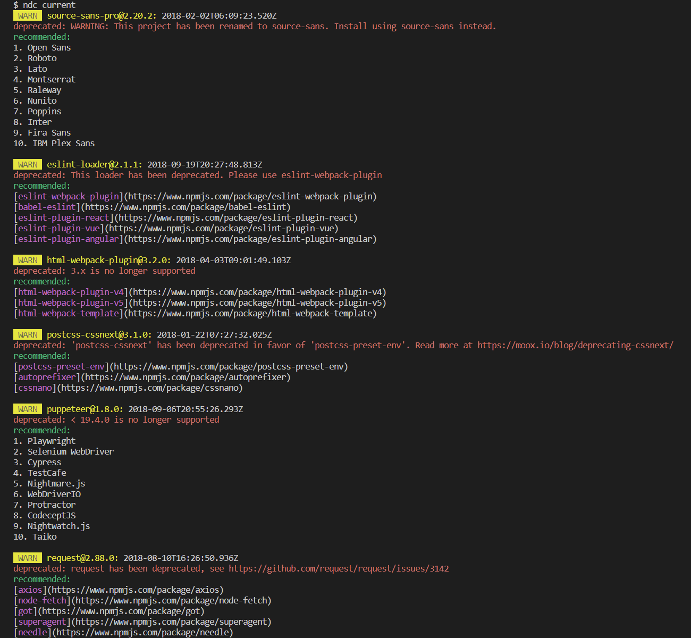

<h1 align="center">npm-deprecated-check</h1>
<p align="center">Check for deprecated packages</p>

## Preview

<p align="center"></p>

## Requirements

Since version 1.4.0, `npm-deprecated-check` requires Node.js 18 or higher.

## Install

```bash
npm install -g npm-deprecated-check
```

## Features

- Check the packages of current project, global or specified is deprecated.
- According to the version range of lockfile and package.json.
- Additionally checks if the running node version reached End Of Life.
- Return the minimum upgradable version.
- Check if the current environment meets the Node.js version range required for dependency operation.
- Calculate the minimum Node.js version required across all dependencies.
- Suggest compatible dependency versions when Node.js version requirements are not met.
- Check Node.js version compatibility for a project or package when upgrading or downgrading Node.js.
- MCP Server support: expose tools for external AI agents to consume deprecation data.

## Node.js Version Compatibility

The tool automatically analyzes Node.js version requirements across all dependencies and provides helpful information.

### Default Output

By default, you get a concise summary showing the recommended engines.node value:

```
Node Version Summary:
Minimum engines.node: >=20.0.0

Recommendation: Update package.json engines.node to ">=20.0.0"
   Current: >=18.12
```

### Detailed Output (--verbose)

Use the `--verbose` flag for detailed information:

```bash
ndc current --verbose
```

```
Node Version Summary (detailed):
Minimum Node version (production): 20.0.0
  Determined by: eslint@9.35.0
Minimum Node version (development): 20.17.0
  Determined by: typescript@5.7.2
Current Node version: v25.4.0
Project engines.node: >=18.12

Production dependencies require Node >=20.0.0, but package.json allows >=18.12
   Consider updating engines.node to ">=20.0.0"
```

### Compatible Version Suggestions

When a dependency requires a newer Node.js version than you're currently running, the tool suggests a compatible alternative version:

```
WARN  eslint@9.35.0: 2024-10-05T18:45:12.345Z
Required node: ^18.18.0 || ^20.9.0 || >=21.1.0
Compatible version for current Node: 8.57.1
```

## Usage

```bash
Usage: ndc <command> [options]

Options:
  -V, --version                    output the version number
  -h, --help                       display help for command

Commands:
  current [options]                check the packages of the current project
  global [options]                 check global packages, default: npm
  package [options] <packageName>  check for specified package
  compat [options] [packageName]   check Node.js version compatibility for project or package
  node                             check if used node version is deprecated (reached End Of Life)
  config [options]                 inspect and modify the config
  help [command]                   display help for command
```

For `current`:

```bash
Options:
  --registry <value>        specify registry URL, default: https://registry.npmjs.org/
  --ignore <value>          ignore specific packages, example: request,tslint
  --failfast                exit the program if it has been deprecated
  --deep                    deep inspection for monorepo projects
  --verbose                 show detailed Node version compatibility information
```

For `global`:

```bash
Options:
  -m, --manager <value>      check specified package manager (choices: "npm", "yarn", "pnpm")
  --registry <value>        specify registry URL, default: https://registry.npmjs.org/
  --ignore <value>          ignore specific packages, example: request,tslint
  --failfast                exit the program if it has been deprecated
```

For `package`:

```bash
Options:
  -r, --range <value>       check specified versions
  --registry <value>        specify registry URL, default: https://registry.npmjs.org/
```

For `compat`:

```bash
Usage: ndc compat [packageName] [options]

check Node.js version compatibility for project or package

Options:
  --node <version>          target Node.js version (e.g. "18", "20.11.0"), default: current Node version
  --deep                    deep inspection for monorepo projects (project mode only)
  --ignore <value>          ignore specific packages, example: request,tslint
  --registry <value>        specify registry URL, default: https://registry.npmjs.org/
```

### Compat Examples

Check current project against the current Node version:

```bash
ndc compat
```

Check current project against a target Node version:

```bash
ndc compat --node 18
```

Check a specific package against a target Node version:

```bash
ndc compat esbuild --node 18
```

Deep check monorepo projects:

```bash
ndc compat --node 20 --deep
```

You can also save options to global configuration:

```bash
Usage: ndc config [options]

inspect and modify the config

Options:
  -g, --get <path>          get value from option
  -s, --set <path> <value>  set option value
  -d, --delete <path>       delete option from config
  -l, --list                list all options
```

## MCP Server

`npm-deprecated-check` can run as an MCP (Model Context Protocol) Server, exposing its checking capabilities as tools for AI agents.

### Start the MCP Server

```bash
npx npm-deprecated-check --mcp
```

### Client Configuration

**Claude Desktop / OpenCode:**

```json
{
  "mcpServers": {
    "npm-deprecated-check": {
      "command": "npx",
      "args": ["npm-deprecated-check", "--mcp"]
    }
  }
}
```

### Available Tools

| Tool | Description |
|------|-------------|
| `check_package` | Check if a specific npm package is deprecated |
| `check_current_project` | Check all dependencies of the current project |
| `check_global` | Check globally installed packages |
| `check_node` | Check if the current Node.js version has reached EOL |
| `check_compat` | Check Node.js version compatibility for a project or package |

All tools return structured JSON data. The AI agent can use this data to provide recommendations, suggest alternatives, or generate reports.

### Tool Parameters

**check_package:**
- `packageName` (required) — npm package name
- `range` (optional) — version range, e.g. `"^1.0.0"`
- `registry` (optional) — custom npm registry URL

**check_current_project:**
- `ignore` (optional) — comma-separated package names to ignore
- `deep` (optional) — deep inspection for monorepo projects
- `registry` (optional) — custom npm registry URL

**check_global:**
- `manager` (optional) — package manager: `"npm"`, `"yarn"`, or `"pnpm"` (default: `"npm"`)
- `ignore` (optional) — comma-separated package names to ignore
- `registry` (optional) — custom npm registry URL

**check_node:** No parameters.

**check_compat:**
- `packageName` (optional) — npm package name. If not provided, checks the current project
- `nodeVersion` (optional) — target Node.js version (e.g. `"18"`, `"20.11.0"`). Defaults to current Node version
- `projectPath` (optional) — absolute path to project root (only used when `packageName` is not provided)
- `deep` (optional) — deep inspection for monorepo projects
- `ignore` (optional) — comma-separated package names to ignore
- `registry` (optional) — custom npm registry URL

## Credits

`npm-deprecated-check` is inspired by [`check-is-deprecated`](https://github.com/awesome-cli/check-is-deprecated).
